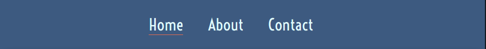
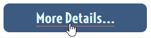
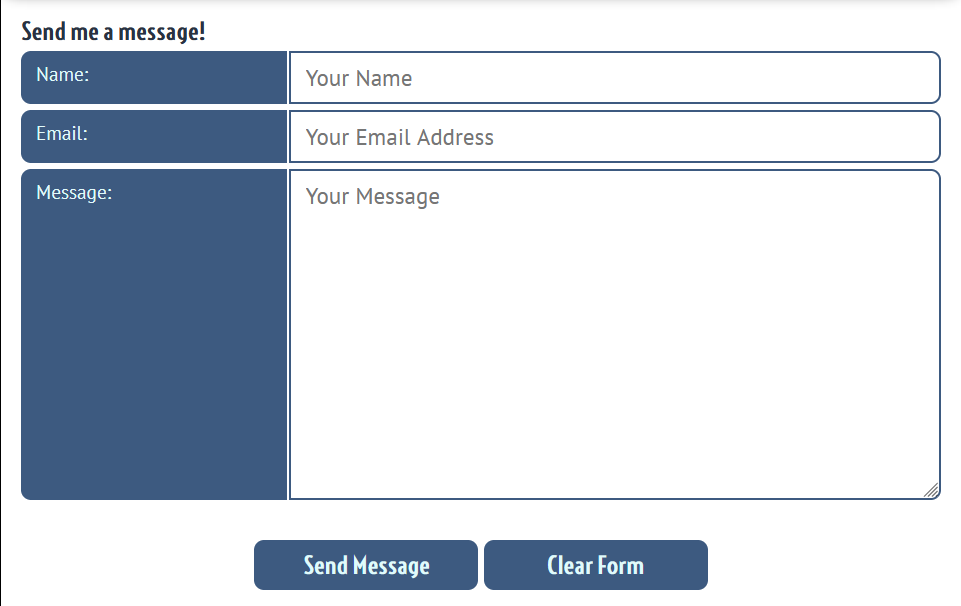
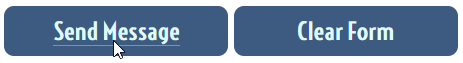

# Game Dev Portfolio

This project is a static HTML site that is used to showcase the projects I have been working on while learning C# and Unity game development.

[//]: # (Insert responsive picture here http://ami.responsivedesign.is/#)

## Table of Contents
* [Design](#design)
    * [User Stories](#user-stories)
    * [Site Design Mockups](#site-mockups)
* [Features](#features)
    * [All Pages](#all-pages)
    * [Home Page](#home-page)
    * [About Page](#about-page)
    * [Contact Page](#contact-page)
    * [Game Specific Pages](#game-specific-pages)
* [Testing](#testing)
    * [Functionality and Feature Testing](#functionality-and-feature-testing)
    * [Validator Testing](#validator-testing)
* [Deployment](#deployment)
* [Credits](#credits)

## Design
### User Stories
- __As an end user of the site, I want to:__
    - Be quickly presented with a clear understanding of what the website is about.
    - Be able to navigate the site with an intuitive layout, and not have to guess what to do to get where I want to go.
    - See media for the games being presented that is displayed at an easy to see size.
    - Have a clear description of what each item in the portfolio is.
    - Be able to play the games being showcased.
- __As someone using the site as a portfolio, I want to:__
    - Be able to add new items to the portfolio easily, with each one styled consistently.
    - Change the site's colour palette easily.
    - Allow site users to contact me to discuss the projects on my site.
    - Give users links to other sites etc. that can give them more information about me.

### Site Mockups
-  __Index Page__
    - 
- __Portfolio Item Specific Page__
    - 
- __About Page__
    - 
- __Contact Page__
    - 

## Features

### All Pages

- __Title Bar__
    - Main title for the site, presenting a quick, single statement to the user describing what they can expect to see on the site.  
    

- __Navigation Bar__
    - The responsive navigation bar is present on all pages, allowing consistent navigation between the main portfolio page, the "about me" page, and the contact form page.
    - This allows the user to access the main pages of the site without having to use browser navigation buttons.  
    
    - The link to the currently active page is highlighted to the user with the link underlined, and when the user moves over the non-active links, they are highlighted in the same way, giving visual feedback that the link can be clicked and will become the new active link.  
    
    - A high contrast colour scheme and font size is used to allow easy readability for the user.  
    

- __Always Visible Navigation__
    - Both the title bar and navigation bar stick to the top of the page, with other content hiding behind it when the page is scrolled, meaning the page navigation is always visible to the user.  
    

### Home Page    

- __Portfolio Items__
    - This section presents the different portfolio items to the user.
    - A screenshot of the start screen is shown, followed by the title of the game, the date the game was published and a brief description of the game.  
    
    - A "More details" button under each item's description takes the user to the dedicated page for that game.
    - This button features a high contrast underline on the text when the user hovers over it, providing visual feedback that it can be clicked on.  
    

### About Page
- __About Me__
    - A stylised picture of me created using https://www.bitmoji.com/ is displayed.  
    - A few short paragraphs of text describing my past career and progress into game development is placed next to the image, to give the user a quick insight into what I've done to date.  
    
    - Underneath the description, links to files and social media are shown, such as a link to my CV and GitHub profile.
    - These links have the same hover highlighting as the navigation bar and buttons used elsewhere in the site, providing consistent feedback on their functionality to the user.
    - The Title property on each link is set to provide a tooltip to the user, indication where the link will take them.
    - As all links are to external sites, the target for each link is set to open a new browser tab.  
    

### Contact Page
- __Contact Form__
    - Presents the user with a method to contact me with a short message, supplying their name and email address to allow for a response to be sent back.  
    - Submit and form reset buttons are present to allow the user to send their message, or clear the form out if they wish to re-start or cancel sending the message.  
    
    - A distinctive contrasting colour is used to highlight which section of the form is active.
    - Clicking the label next to the input element sets the cursor focus to that input.
    - All fields are required and the form will not submit if any are missed.  
    
    - The submit and form reset buttons feature the same mouse over highlighting to give the user visual feedback that the button can be clicked.  
    

### Game Specific Pages
[//]: # (Insert game specific page info here once complete)

## Testing

### Functionality and Feature Testing
[//]: # (Insert testing screenshots once all pages in place.)

### Validator Testing
[//]: # (Insert screenshots of HTML https://validator.w3.org and CSS https://jigsaw.w3.org/css-validator/ validators when testing complete.)

## Deployment
[//]: # (Description of how to clone the GitHub repo, edit the HTML content and host the page. CSS variables for quick colour palette editing shown here.)

## Credits
Colour palette: https://coolors.co/3d5a80-98c1d9-e0fbfc-ee6c4d-293241

Fonts:
Title: https://fonts.google.com/specimen/Voltaire
Main text: https://fonts.google.com/specimen/PT+Sans

Resources:
CSS Variables: https://www.w3schools.com/css/css3_variables.asp
https://stackoverflow.com/questions/18548465/prevent-scroll-bar-from-adding-up-to-the-width-of-page-on-chrome
https://www.sitepoint.com/css-grid-web-form-layout/